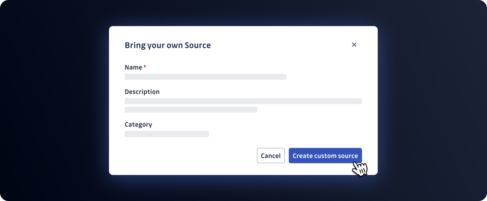

# GitGuardian BYOS Integration Hub

**Bring Your Own Source (BYOS) - Scan Any Data Source for Secrets**



[](./LICENSE)
[](./CONTRIBUTING.md)
[](https://www.gitguardian.com/)

Welcome to the **GitGuardian BYOS Integration Hub**! This repository provides ready-to-use examples and integration patterns to help you scan **any custom data source** for exposed secrets, credentials, and sensitive information using GitGuardian's powerful detection engine.

## 🎯 What is BYOS?

**Bring Your Own Source (BYOS)** extends GitGuardian's secret detection capabilities to any data source in your organization—even those without native integrations.

> 💡 **Can't find a native integration for your source? Bring your own!**

With BYOS, you can:
- ✅ Scan **any text-based content** from custom applications, legacy systems, or unique workflows
- ✅ Leverage **450+ built-in secret detectors** (API keys, database credentials, tokens, certificates, and more)
- ✅ Get **automatic incident creation** in your GitGuardian dashboard with severity levels and remediation guidance
- ✅ Maintain **comprehensive security coverage** across your entire infrastructure
- ✅ Integrate seamlessly using **Python SDK** or **REST API**

## 🚀 Available Integrations

This repository includes production-ready integrations for popular platforms:

| Integration | Description | Use Case |
|------------|-------------|----------|
| [**🤖 Anthropic Claude**](./anthropic-claude/) | Scan Claude project configurations and system prompts | AI/LLM prompt security |
| [**🌪️ Dust**](./dust/) | Scan Dust agent instructions and workflows | AI agent security |
| [**📝 GitHub Gists**](./github-gist/) | Scan public and private GitHub Gists | Code snippet security |
| [**🔗 GitLab Snippets**](./gitlab-snippets/) | Scan GitLab code snippets | Code snippet security |
| [**🧠 OpenAI**](./openai-chatgpt/) | Scan OpenAI Assistant configurations | AI/LLM assistant security |

**Each integration includes:**
- 📦 Complete source code with best practices
- 📖 Setup instructions and configuration examples
- 🔄 Automatic scanning with change detection
- 🛡️ Direct integration with GitGuardian's incident management

## 💼 Why BYOS for Your Organization?

### For Security Teams
- **Exhaustive Coverage**: Ensure secret scanning coverage across all data sources- **Centralized Secret Management**: All detected secrets flow into a single GitGuardian dashboard
- **Incident Response**: Automated alerting and remediation workflows

### For Developers
- **Easy Integration**: Simple Python scripts or REST API calls
- **Flexible Deployment**: Run on-demand, scheduled, or event-driven
- **Extensive Detection**: 450+ secret types detected automatically
- **Clear Documentation**: Well-documented examples to adapt for your needs

### For DevOps Teams
- **CI/CD Integration**: Scan build logs, deployment configs, and infrastructure code
- **Automation Friendly**: Integrate with existing automation pipelines
- **Scalable**: Scan thousands of documents efficiently
- **Low Maintenance**: Minimal infrastructure requirements

## 🏁 Quick Start

### 1️⃣ Set Up Your Custom Source

First, create a custom source in your GitGuardian dashboard:

1. Navigate to **Internal Monitoring** → **Sources**
2. Click **Add Source** → **Custom Source**
3. Name your source (e.g., "Confluence Wikis", "Jenkins Logs")
4. Copy the **Source UUID** for later use

📚 [Detailed BYOS Setup Guide](https://docs.gitguardian.com/internal-monitoring/integrate-sources/bring-your-own-sources)

### 2️⃣ Generate API Credentials

Create a service account with scanning permissions:

1. Go to **Settings** → **API** → **Service Accounts**
2. Create a new service account
3. Grant **`scan`** and **`scan:create-incidents`** permissions
4. Save the generated API key securely

### 3️⃣ Choose Your Integration Method

#### Option A: Use ggshield CLI

Scan any content directly with ggshield:

```bash
# Install ggshield
pip install ggshield

# Scan a file
ggshield secret scan path /path/to/your/file

# Scan a directory
ggshield secret scan path /path/to/directory --recursive

# Scan with BYOS (creates incidents in dashboard)
ggshield secret scan path /path/to/file --source <SOURCE_UUID>
```

📚 [ggshield Documentation](https://docs.gitguardian.com/ggshield-docs/getting-started)

#### Option B: Use Existing Integrations

Browse our ready-to-use integrations and customize them:

```bash
# Clone this repository
git clone https://github.com/GitGuardian/gg-byos-lab.git
cd gg-byos-lab

# Choose an integration (e.g., GitHub Gists)
cd github-gist

# Install dependencies
pip install -r requirements.txt

# Configure your credentials
cp env.example .env
# Edit .env with your API keys

# Run the scanner
python scan_github_gists.py
```

#### Option C: Build Your Own Integration

Use the Python SDK for custom integrations:

```python
from pygitguardian import GGClient

# Initialize the client
client = GGClient(api_key="your_api_key")

# Prepare your documents
documents = [
    {
        "document": "your content to scan",
        "filename": "source_file.txt"
    }
]

# Scan and create incidents
result = client.scan_and_create_incidents(
    documents=documents,
    source_uuid="your_source_uuid"
)

# Handle results
if result.success:
    print(f"Scan completed: {len(result.scan_result.secrets)} secrets found")
```

Or use the REST API directly:

```bash
curl -X POST https://api.gitguardian.com/v1/scan/create-incidents \
  -H "Authorization: Bearer YOUR_API_KEY" \
  -H "Content-Type: application/json" \
  -d '{
    "source_uuid": "YOUR_SOURCE_UUID",
    "documents": [
      {
        "document": "content to scan",
        "filename": "example.txt"
      }
    ]
  }'
```

## 🔧 Common Use Cases

### AI/LLM Security
- Scan Claude projects, OpenAI assistants, and custom AI prompts
- Detect secrets in system prompts and training data
- Secure AI agent configurations

### Code Snippet Security
- Monitor GitHub Gists and GitLab Snippets
- Scan developer documentation and wikis
- Check code examples and tutorials

### Infrastructure Security
- Scan Terraform configurations and Ansible playbooks
- Check Kubernetes manifests and Helm charts
- Audit infrastructure-as-code repositories

### CI/CD Security
- Scan Jenkins, GitHub Actions, or GitLab CI logs
- Check build artifacts and deployment scripts
- Monitor pipeline configurations

### Legacy System Security
- Scan SFTP servers and file shares
- Check mainframe outputs and reports
- Audit database configuration files

## 🤝 Contributing

We welcome contributions from the community! Whether you're:
- 🔌 Adding a new integration
- 🐛 Fixing bugs or improving existing integrations
- 📚 Enhancing documentation
- 💡 Sharing use cases and best practices

Please read our [Contribution Guidelines](./CONTRIBUTING.md) to get started.

### Popular Integration Requests

We'd love to see contributions for:
- 🔧 CI/CD platforms (CircleCI, Travis CI, Azure DevOps)
- 📁 File storage (Dropbox, Box, OneDrive)
- 💬 Communication platforms (Slack archives, Microsoft Teams)
- 📊 Documentation tools (Notion, Confluence, MediaWiki)
- 🗄️ Database configs (PostgreSQL, MySQL, MongoDB)
- ☁️ Cloud services (AWS CloudFormation, Azure ARM templates)

## 📚 Resources

- 📖 **[Official BYOS Documentation](https://docs.gitguardian.com/internal-monitoring/integrate-sources/bring-your-own-sources)**
- 🐍 **[Python SDK (py-gitguardian)](https://github.com/GitGuardian/py-gitguardian)**
- 🔗 **[GitGuardian API Reference](https://api.gitguardian.com/docs)**
- 🛡️ **[ggshield CLI Documentation](https://docs.gitguardian.com/ggshield-docs)**
- 💬 **[Community Forum](https://community.gitguardian.com)**

## 🆘 Support

- 💬 **Questions?** Open an [issue](https://github.com/GitGuardian/gg-byos-lab/issues) or visit our [Community Forum](https://community.gitguardian.com)
- 📧 **Enterprise Support:** Contact your GitGuardian account team
- 🐛 **Found a bug?** Submit a detailed [bug report](https://github.com/GitGuardian/gg-byos-lab/issues/new)
- 💡 **Feature request?** Share your ideas in [discussions](https://github.com/GitGuardian/gg-byos-lab/discussions)

## 📄 License

This project is licensed under the Apache License 2.0 - see the [LICENSE](./LICENSE) file for details.

---

<div align="center">

**🛡️ Secure your code. Protect your secrets. Scale your security.**

[Get Started with GitGuardian](https://www.gitguardian.com/) | [Book a Demo](https://www.gitguardian.com/demo) | [Documentation](https://docs.gitguardian.com)

</div>
